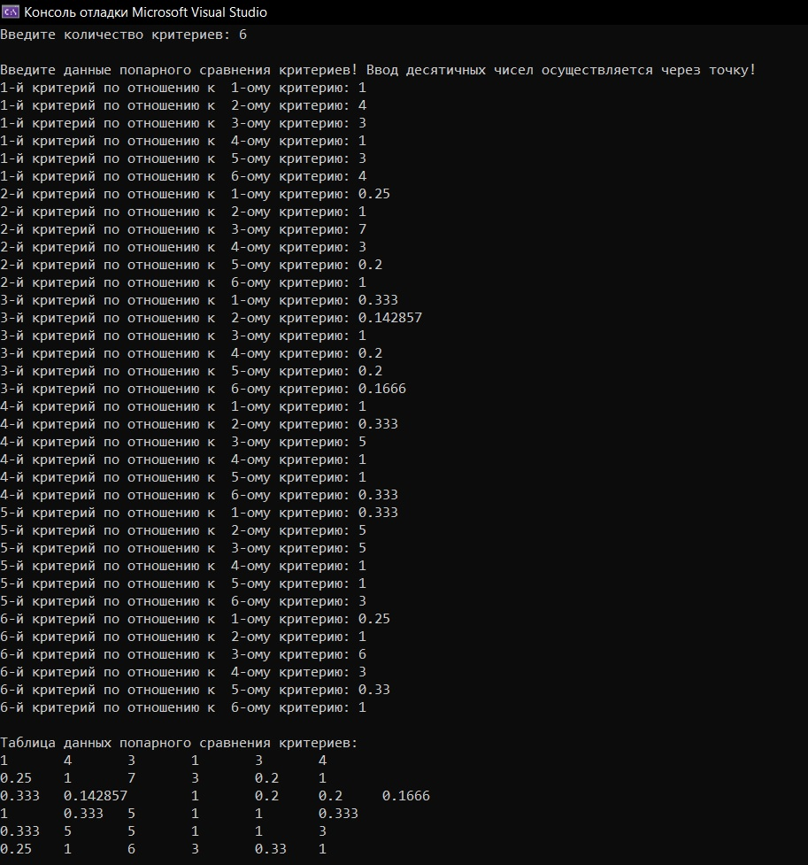
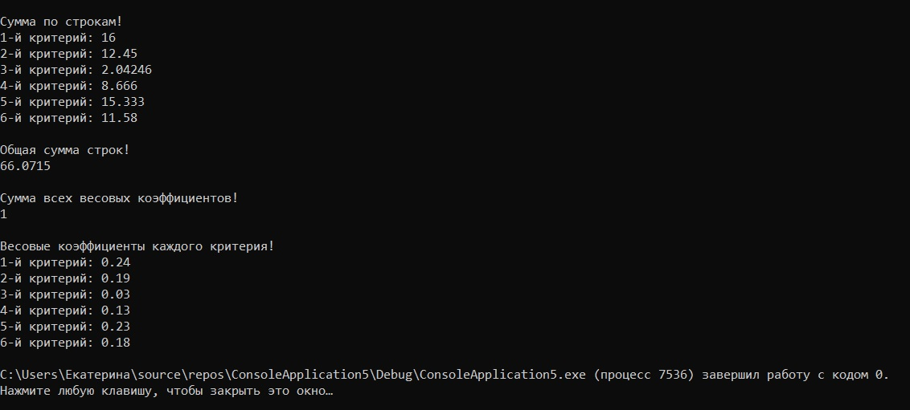

#practice2
1. Я написала на языке С++ программу реализующую метод анализа иерархий Томаса Саати для одного уровня.
2. При успешном запуске высветится консоль, в которую будет необходимо ввести: количество критериев, а затем данные попарного сравнения критериев. Программа выводит на экран          введенную таблицу данных попарного сравнения критериев, подсчет суммы по строкам данных, общую сумму всех строк. Затем происходит вывод суммы всех весовых коэффициентов,          которая равна 1 и самих весовых коэффициентов каждого критерия. Программа завершает свою работу.
   Вот листинг теста программы:
   
   Возможно нагляднее Листинг 2!
   Также предусмотрена проверка на ввод количества критериев, должно быть введено целое число, и реализовано освобождение памяти от динамических массивов.
   
3. Необходимо открыть файл программы ConsoleApplication6.cpp. Её запуск  осуществляется в среде разработки, в нашем случае в Visual Studio. Его можно осуществить с помощью горячих    клавиш ctrl+F5 или с помощью меню: выбрать в строке    меню Сборка -> пункт Собрать решение, Отладка -> пункт Запуск без отладки. 
